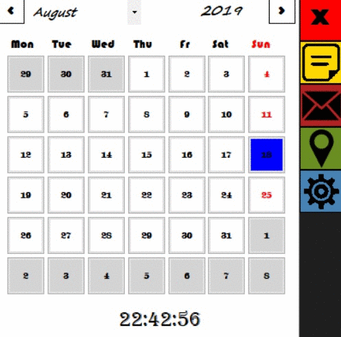

# MyCalendar (NOT FINAL)
 Window Form based calendar for Windows
 
# Introduction

MyCalendar is created in C# + Visual Studio application, created for better time management. Main focus of app is to centralize users mails, meetings and notes for fast access. The calendar renders all terms in the main window, on chosen day and makes it easy to access by just click on chosen day. Thanks to custom controls, for adding new terms user doesn't need to open a new window. Application is fully customizable, works in the background and user can set default e-mail, making working with calendar even faster.

# Technologies

App is programmed in C# language, based on .Net framework in version 4.7.1, for correct working I recommend update/ install minimum to this version. Libraries used in project:
* Drawing for custom form modification
* Globalization for setting default dates to optimize application
* IO for managing files and directories in application folder
* Linq for operating on strings and file names
* RegularExpressions for avoid bad format bugs
* Net.Mail for connecting to mail server and automate the message sending
* Google.Apis.Calendar for synchronizing app with Google Calendar events
* Google.Apis.Auth.OAuth2 for user authentication

# Setup

(To add)

# Features

Calendar main features:

* Background working - application is set to work in the background with easy ways to minimalize and reset from toolbox bar
* reminders - user can set alert to remind him for incoming notes 
* e-mail sending - easy way to send e-mail from users mailbox to chosen receiver with option to set automatic sending at a certain time
* Google Calendar synchronization - adding meetings from app level direct to users Google Account makes it easy to set phone and e-mail reminders
* Fully customizable - from settings position user can set calendar colors, default e-mail, reset authentication and delete notes
* App saves user configurations - settings like window position, colors and notes

# Motivation

Starting point of development was to make Windows Calendar. After reading about all Apis to use I realize that they to hard to implement into other projects (problem with sending input to calendar) so i decided to write my own Calendar Api. After that I started to improve functionality by adding custom notes, than implement mail sending and finally Google Calendar Apis. Next main goal was to implement WinForms controls to project for making app more intuitive, so i learned how to work on them, modify the code and finally create custom controls. Finally, the project was ready to use after some code optimization. Hope you'll enjoy using it!

# Others

### Report Bug and improves

You can report encountered bugs or send ideas for improvement [here](https://github.com/TomaszOrpik/MyCalendar/issues/new)

### To-Do

* Make default text visible when user doesn't make input in window form
* Code refactoring
* create setup file and modify Readme

### License

Application was uploaded under GENERAL PUBLIC LICENSE for more information [check license file](https://github.com/TomaszOrpik/Music-Player/blob/master/LICENSE)

### Contact

Feel free to [Contact me!](https://github.com/TomaszOrpik)
